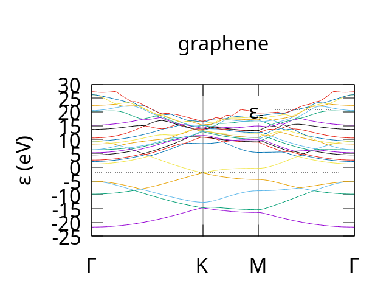
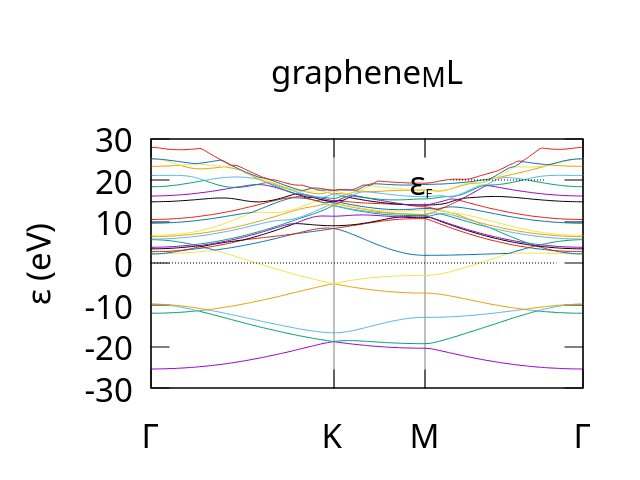

.. _Examples:

ML Atomic Potentials 
====================

Using MatBench Discovery Models
-------------------------------
`Matbench Discovery`_ is an interactive leaderboard which ranks 
popular ML models for inter-atomic potentials. Definition 
files for the top 20 models [1]_ can be found in the ``Images``
directory. These are also all setup with corresponding config files in
``Container_Configs/MatBench_Discovery`` such that you can 
simply refer to them by name.

.. [1] At time of writing (May 2026)
.. _Matbench Discovery: https://matbench-discovery.materialsproject.org/

To use a model, for example the current number 
two model, eSEN-30M-OAM, we first need to load the model with:

.. code-block:: bash

    ml-toolkit load eSEN-30M-OAM

This will download some files and create a Container image 
``eSEN-30M-OAM.sif`` in the ``Images`` directory. 
Note: this only needs to done the first time you use the model.

Once this is complete we can run something in the container using:

.. code-block:: bash

    ml-toolkit run eSEN-30M-OAM $COMMAND

Where $COMMAND is the command you would like to run inside the container.

A brief note on using Models from MetaAi:
*****************************************

Unfortunately, due to MetaAi's licencing terms you need both a Huggingface account and an API key to be able to download model
checkpoints for use with ml-toolkit. Furthermore they have gone out of there way to prevent automation. 

Thus if you attempt to build/use any of the models tagged MetaAi. that is any of the following:

- eqV2-L-DeNS
- eqV2-M-DeNS
- eqV2-S-DeNS
- eqV2-S
- eSEN-30M-MP
- eSEN-30M-OAM
- eqV2-S-OAM
- eqV2-M-OAM
- eqV2_M
- eqV2-L-OAM
- eSEN-30M-OMat
- eqV2-S-OMat
- eqV2-M-OMat
- eqV2-L-OMat
- omat24
- uma-s-1
- uma-s-1p1
- uma-m-1p1
- uma
  
you will likely be greeted with an error similar to the following:

.. code-block::

    ********************************************************************************
    ************************** Loading Model Config Files***************************
    ********************************************************************************
                            All config files look good                           
    ********************************************************************************
    *** You have asked for a model that requires a HuggingFace API key to build.****
    **** This needs to be provided in: ${ML_TOOLKIT_HOME}/API_Keys/HF_AUTH.key  ****
    ************************* See the docs for more details*************************

In which case you will need to do some manual setup by following the instructions 
under :ref:`Using Models from MetaAi <MetaAi>`

Using the Atomic Simulation Environment
***************************************

In this next example we will predict the atomic potential of a simple hydrogen 
molecule.

The vast majority of Models listed on Matbench Discovery 
can be used through python via the Atomic Simulation 
Environment (`ASE`_).

.. _ASE: https://ase-lib.org/

In principle to get the predicted atomic potentials 
we simply need to setup an ASE calculator then use the 
``get_potential_energy()`` method. The problem, however,is 
every model uses it's own calculator with there own setup steps.

To make things easier in the Scripts directory we have provided a 
python function ``initialise_model()`` that takes in a string that
is the name of the model you wish to use and returns an appropriate
ASE calculator for that particular ML model.

As such the following is an example of how to predict and extract the potential
of a hydrogen molecule and using ASE and a model from MatterSim:

.. code-block:: python

    # Example script to get potential of H2 molecule from with MatterSim through ASE
    # This should be run inside the MatterSim container.

    from Matbench_Models import Get_ASE_Calculator
    from ase import Atoms
    from ase.optimize import BFGS
    from ase.calculators.nwchem import NWChem
    from ase.io import write

    # Setup the system with ASE, in this case a simple H2 molecule
    h2 = Atoms('H2', positions=[[0, 0, 0],[0, 0, 0.7]])

    # Tell ASE to use MatterSim as a Calculator
    h2.calc = Get_ASE_Calculator('MatterSim_V1_5M')

    # Do the calculations
    opt = BFGS(h2)
    opt.run(fmax=0.02)
    write('H2.xyz', h2)
    h2.get_potential_energy()

This should be run with the ml-toolkit as:

.. code-block:: bash

    # change directory to to wherever ml-toolkit is installed
    cd $ML_TOOLKIT_HOME
    # This only needs to be done the first time
    ml-toolkit build MatterSim_V1_5M
    
    ml-toolkit run MatterSim_V1_5M python3 $ML_TOOLKIT_HOME/Scripts/Examples/H2_MatterSim.py

From here you could do some further analysis with ASE or convert the data for use 
with another tool. In our case we will move on to calculating charge density 
using CASTEP.

Interfacing with CASTEP
-----------------------

CASTEP can use an external routine to perform energy, force and stress calculations 
using ML models in two distinct ways:

1. The "File" method
2. The "Server" method

At this stage users should note that both of these methods are **still considered experimental**. 
As such they use a **developer keyword**. The current plan is to release them as an **official keyword in CASTEP 27**.

The File Method
***************

Conceptually, this is the simplest approach. Whenever CASTEP need to update the energy,
forces, and stresses it writes the current geometry to a .cell file. It then calls an 
external process. This process reads in the .cell file evaluate the energy, force 
and stress, writing the results to a .geom file. CASTEP then reads in this .geom file 
and carries on it merry way.

We note that Whilst it's simple, this approach has a non-trivial overhead and likely 
will not scale well to more than a few mpi-processes. As such it is only really recommended 
for small scale testing. It is however the **only option available** if you are using 
**CASTEP version 25 or older**.

The Server Method
*****************

The method is **new to CASTEP V26** (the latest version at the time of writing). It involves
running a stand-alone application which both: evaluates the energy, force and stress; and 
acts as a network server. CASTEP can then talk to this application over the network and 
request updated values for energy, force and stress as needed. 

This is more a bit more complex to setup but has three major advantages:

1. You can run multiple servers at once allowing you to easily scale over many mpi mpi-processes. 
2. I uses the network for communication so the overhead will be minimal.
3. It's more robust, the server and CASTEP are completely independent. As such if one or the other 
   encounters a problem and crashes they can easily be restarted and start back from an earlier 
   point in time.

CASTEP Examples
---------------

Please note this is not an extensive tutorial for CASTEP. We assume users already have some 
familiarity with CASTEP. Thus we will not be covering the basics of how to use it, or any of
the theory behind these calculations.

If you need this CASTEP already has `extensive documentation`_ and we will adapting several of the tutorial 
examples to work with ML potentials. For users on Bede CASTEP is licenced on a project by project basis. 

If your project has a licence there will be a folder available under ``/projects/{PROJECT_CODE}/castep26`` 
containing copy CASTEP 26 complied for grace-hopper (if not you will need to ask the bede admin team for 
access). For anyone else you will need to `install a recent version of CASTEP`_ (preferably Version 26).

.. _install a recent version of CASTEP: https://www.castep.org/get_castep
.. _extensive documentation: https://castep-docs.github.io/castep-docs/

Charge density of Si lattice (file method)
------------------------------------------

We will start with a simple calculation used in the CASTEP `charge density tutorial`_. It consists of 
a Si lattice made from a 3 atom unit cell. The CASTEP .cell file should be as follows:

.. code-block::

    %block lattice_abc
    3.8 3.8 3.8
    60 60 60
    %endblock lattice_abc
    !
    ! Atomic co-ordinates for each species.
    ! These are in fractional co-ordinates wrt to the cell.
    !
    %block positions_frac
    Si 0.00 0.00 0.00
    Si 0.25 0.25 0.25
    %endblock positions_frac
    !
    ! Analyse structure to determine symmetry
    !
    symmetry_generate
    !
    ! Specify M-P grid dimensions for electron wave-vectors (K-points)
    !
    kpoint_mp_grid 4 4 4

and the .param file:

.. code-block::

    xc_functional : LDA
    cutoff_energy : 1500 eV
    #this next line causes the charge to be written in a den_fmt file
    write_formatted_density : T  
    spin_polarised : false

Before using any ML models we recommend running this as is to get the ``silicon.den_fmt`` to compare against. 
We also recommand renaming this to file to make comparisons easier.

Users on bede will want to create a slurm script ``test_castep.sh`` to run on the compute nodes using the following template:

.. code-block:: bash

    #!/bin/bash
    # Example SLURM script for CASTEP 
    # with the ml-toolkit
    ##########################################
    #SBATCH --account CHANGE_ME              # charge job to specified account
    #SBATCH --cpus-per-task 1                # number of cpus required per task
    #SBATCH --job-name castep_test           # name of job
    #SBATCH --ntasks 1                       # number of processes required
    #SBATCH -o castep_test.out               # File to redirect program output
    #SBATCH -e castep_test.err               # File to redirect any errors
    #SBATCH --time 10                        # time limit (in mins)
    #SBATCH --partition ghtest               # Choose either gh or ghtest
    #SBATCH --gres gpu:1                     # Number of GPUs required for the job
    ##########################################
    # source the python virtual environment
    source ~/.venv/ml-toolkit/bin/activate
    module load castep
    # change directory to where Si.param and Si.cell are located
    cd /location/of/si.param
    castep.serial Si

you can then submit the batch script with

.. code-block:: bash

    sbatch castep_test.sh

Users on there own machines can just run CASTEP as you normally i.e.

.. code-block:: bash

    # for serial
    castep.serial Si
    # or mpi parallel
    mpirun -n 4 castep.mpi Si

Modification to work with ML Potentials
***************************************

To modify this to work with an ML potential we you first we need to ensure you have activated your python virtual 
env if you have not already done so. [#]_ In the Scripts directory for ML_toolkit you will find two files: 
predict.sh and ML_file.py these will be used by CASTEP to call ml-toolkit at the appropriate time 
and tell it which model to use.

Next we need to modify the param file by adding the following devel_code block to the end of the Si.param file.

.. code-block:: 

    %block devel_code

    PP=T

    PP:

        # Run external script method
        EXT=T

        # Don't delete extra files generated for communication with external script
        EXT_CLEANUP=F

        # Command used to call the external script used to predict energy/stress/forces
        EXTCALL: ${ML_TOOLKIT_HOME}/Scripts/predict.sh MatRIS_10M_OAM :ENDEXTCALL

    ENDPP:

    %endblock devel_code

This uses the pair-potential (PP) devel_code to tell CASTEP to get energy, stress and forces using 
an external script. The line ``EXT=T`` tells CASTEP to call an external command. ``EXT_CLEANUP=F`` 
tells it not cleanup the extra files at the end. You may wish to set this to true for larger runs 
to avoid clogging up the file system. 

The final line of interest is ``EXTCALL: ${ML_TOOLKIT_HOME}/Scripts/predict.sh MatRIS_10M_OAM :ENDEXTCALL`` 
This defines the command run by CASTEP each time it needs the energy, stress and forces. In this case
it uses predict.sh in the ``ML_Toolkit/Scripts`` directory. You will also notice this defines which model to 
use. This can be any model you like, for this example we have chosen one from MatRIS.

Before running CASTEP we next need to ensure we have built an appropriate container for our ML model. 
As previously discussed we have chosen one from MatRIS for this example.

.. code-block:: bash

    ml-toolkit build MatRIS_10M_OAM

Once this is complete we can run CASTEP as we did previously i.e.

.. code-block:: bash

    sbatch castep_test.sh

If on Bede or

.. code-block:: bash

    # for serial
    castep.serial Si
    # or mpi parallel
    mpirun -n 4 castep.mpi Si

At this point you can compare the charge density to the original using Vesta as per the original tutorial. 
For users on Bede you will need to copy the files to your local machine and do the analysis there as 
Vesta is not available.

.. _charge density tutorial: https://castep-docs.github.io/castep-docs/tutorials/Bonding_and_Charge/charge_density/
.. [#] You can easily tell if your python virtual env is active if you can see (ml-toolkit) in your terminal. If not you need to run ``source ~/.venv/ml-toolkit/bin/activate``

Bandstructure of Graphene (server method)
-----------------------------------------

Next we'll try something a bit more interesting the following .cell and .param files setup a calculation of the Bandstructure
for a 1D Hexagonal lattice of carbon atoms, a.k.a  Graphene.

.. code-block::

    #Graphene.param
    task : spectral  !bandstructure
    spectral_task : bandstructure

    # Exchange correlation
    xc_functional : PBE

    # Plane wave cutoff
    cut_off_energy : 500 eV

    # SCF settings
    max_scf_cycles : 100
    elec_energy_tol : 1e-6

    # Smearing (graphene is semi-metal)
    smearing_width : 0.1 eV
    smearing_scheme : gaussian

    # Diagonalization
    mixing_scheme : Pulay
    mix_charge_amp : 0.5

    # Output options
    write_bands : true
    write_orbitals : false

    # Geometry
    spin_polarized : false

.. code-block::

    # graphene.cell
    %BLOCK LATTICE_CART
    ang
    2.460000  0.000000  0.000000
    -1.230000  2.130422  0.000000
    0.000000  0.000000 15.000000
    %ENDBLOCK LATTICE_CART

    %BLOCK POSITIONS_FRAC
    C 0.000000 0.000000 0.000000
    C 0.333333 0.666667 0.000000
    %ENDBLOCK POSITIONS_FRAC

    KPOINT_MP_GRID 12 12 1
    KPOINT_MP_OFFSET 0 0 0

    # High symmetry path for graphene band structure
    %BLOCK SPECTRAL_KPOINT_PATH
    0.0  0.0  0.0   ! Gamma
    0.333333 0.333333 0.0   ! K
    0.5  0.0  0.0   ! M
    0.0  0.0  0.0   ! Gamma
    %ENDBLOCK SPECTRAL_KPOINT_PATH

    SPECTRAL_KPOINT_PATH_SPACING 0.02

After running this with CASTEP and plotting the resulting graphene.bands output file you should get output similar to the following:

    example bandstructure for Graphene produced by CASTEP. Note: we used the dispersion.pl plotting 
    script with the -sym=hexagonal parameter to get the correct labels for the path though the 
    brillouin zone.
    
We will now modify the .parm file to tell CASTEP to get potentials, forces and stresses from an external 
server by adding a devel_code block to the .param file.

Note: **the server method will only work for CASTEP version 26** users of older versions of CASTEP will need to 
either use the previously mentioned file method or upgrade to version 26.

.. code-block::

    # required for socket interface
    socket_port 5000 
    socket_host 127.0.0.1

    %BLOCK devel_code
    PP=T
    PP:
        SOC=T
    :ENDPP
    %ENDBLOCK devel_code

Once again, we are using the Pair-potential (PP) devel_code. However, first we use the ``socket_port`` and ``socket_host`` keywords 
to tell CASTEP where to find the external server on the network. In this case ``socket_port 5000``  tells CASTEP to listen on 
network port 5000 [#]_. ``socket_host 127.0.0.1`` tell CASTEP the ip address [#]_ of the server on the local machine.

The remaining lines inside the devel_code block simply enables the PP devel_code and tells CASTEP to get potentials, forces and stresses
 from an external process on the network.

Once the param file has been modified we next need to build a container with the ml-toolkit. In this example we will use 
one of the MetaAi Omat24 models eSEN-30M-OAM [#]_

.. code-block:: bash

    ml-toolkit build eSEN-30M-OAM

Once this is complete if you are on Bede you can use the following bash script as a template:

.. code-block:: bash

    #!/bin/bash
    # Example SLURM script for CASTEP 
    # with the ml-toolkit
    ##########################################
    #SBATCH --account CHANGE_ME              # charge job to specified account
    #SBATCH --cpus-per-task 1                # number of cpus required per task
    #SBATCH --job-name castep_test           # name of job
    #SBATCH --ntasks 1                       # number of processes required
    #SBATCH -o castep_test.out               # File to redirect program output
    #SBATCH -e castep_test.err               # File to redirect any errors
    #SBATCH --time 10                        # time limit (in mins)
    #SBATCH --partition ghtest               # Choose either gh or ghtest
    #SBATCH --gres gpu:1                     # Number of GPUs required for the job
    ##########################################
    # source the python virtual environment
    source ~/.venv/ml-toolkit/bin/activate
    module load castep
    # change directory to where Graphene.param and Graphene.cell are located
    cd /location/of/graphene.param
    ml-toolkit start eSEN-30M-OAM
    castep.serial Graphene
    ml-toolkit stop eSEN-30M-OAM

or if running you are running locally you can just run the following to start ml-toolit as a server in the background. 
Then run CASTEP and finally shut down the server. Note: you may need to use the ``sleep`` command to wait 
for a few seconds between starting the server and CASTEP as the server can take a short while to actually 
start-up. 

.. code-block:: bash

    # change directory to where Graphene.param and Graphene.cell are located
    cd /location/of/graphene.param
    ml-toolkit start eSEN-30M-OAM
    castep.serial Graphene
    ml-toolkit stop eSEN-30M-OAM

Once complete you should get a number of output files. These include  ``Graphene.bands`` which should produce a bandstructure plot similar to the following:

    example bandstructure for Graphene produced by CASTEP using the eSEN-30M-OAM model for potential,
    forces and stresses.
    
    Note: we used the dispersion.pl plotting script with the -sym=hexagonal parameter to get the 
    correct labels for the path though the brillouin zone.

One final thing to note are the files ``eSEN-30M-OAM.out`` and ``eSEN-30M-OAM.err``. These 
contain the output and any errors from the python server. They should (hopefully) be blank 
as there is no output by default. However in the event of any errors these, along with files 
in the TOOLKIT_HOME/logs directory are a good first place to look.

.. [#] For reference a network port is simply a number between 0 and 65535 that points to a location on the network used for communication between programs. See `this site`_ for more information.
.. [#] An ip address is a number used in networking to identify different computers on the network. In our case we are using 127.0.0.1 which is a special number that the computer uses to refer to itself.
.. [#] Once again if you want to use Models from MetaAi you will need to do some manual setup outlined in :ref:`Using Models from MetaAi <MetaAi>` otherwise you will need to use different model.
.. _this site: https://www.geeksforgeeks.org/computer-networks/what-is-ports-in-networking/

Additional Advanced Options
***************************

The server method has a few additional options that can be used to allow for more flexibility and help improve performance when running over many cpu cores with mpi. 
These options can be passed in as command line parameters to the ``ml-toolkit start`` command.

- ``-p, --port PORT_NUM`` sets the TCP port used for network communication. Useful if port 5000 is already in use on your network. must be greater than 1024 default is port 5000.
- ``-t, --timeout TIME``   Server timeout in seconds. The server will be restated if no communication occurs for set amount of time. This is useful for redundancy if the ML model should crash. Must be greater than 0, default is 60 seconds.
- ``-N, --Nservers NUM_SERVERS`` Number of python servers to spawn, for best performance set this to the number of mpi processes, must be greater than 0. Default is 1
- ``-r NUM_RETRY, --num_retry NUM_RETRY`` number of times to retry when waiting for python server. Default: 5
- ``-T TASK, --task TASK``  Task to perform, required for all Meta UMA and selected SevenNet models, ignored by all others.

an example of how to use this is as follows:

.. code-block:: bash

    ml-toolkit start eSEN-30M-OAM -N 6 -p 4124 -t 70

In this case we have asked for 6 severs communicating via TCP port 4124 each with a timeout of 70 seconds.

Si GA (server method)
---------------------

Our final example is taken from the `GA tutorial`_ in the CASTEP docs. It consists of using a genetic algorithm
to predict the most stable structure for a Si lattice (the correct answer for which is a diamond structure).

In this case the cell file already uses the PP devel code so it is easy enough to add in the extra
bits needed to use an ML potential.

For reference the original .cell file is:

.. code-block::

    %block LATTICE_ABC
    ang
    3.8 3.8 3.8
    90  90  90
    %endblock LATTICE_ABC

    %block POSITIONS_FRAC
    Si  0.203  0.617  0.209
    Si  0.844  0.442  0.350
    Si  0.964  0.379  0.096
    Si  0.762  0.524  0.941
    Si  0.544  0.605  0.781
    Si  0.238  0.597  0.531
    Si  0.728  0.914  0.742
    Si  0.209  0.929  0.435
    %endblock POSITIONS_FRAC

    %BLOCK SPECIES_POT
    QC5
    %ENDBLOCK SPECIES_POT

    symmetry_generate
    symmetry_tol : 0.05 ang

and the .param file is:

.. code-block::

    task             = genetic algor # Run the GA
    ga_pop_size      = 12            # Parent population size
    ga_max_gens      = 12            # Max number of generations to run for
    ga_mutate_amp    = 1.00          # Mutation amplitude (in Angstrom)
    ga_mutate_rate   = 0.15          # Probability of mutation to occur
    ga_fixed_N       = true          # Fix number of ions in each member based on input cell

    rand_seed        = 101213 # Random seed for replicability
    opt_strategy     = SPEED  # Run quick

    geom_max_iter    = 211 # Can have a large max iter as using pair potentials

    # Don't write most output files for each population member
    write_checkpoint = NONE
    write_bib        = FALSE
    write_cst_esp    = FALSE
    write_bands      = FALSE
    write_cell_structure = TRUE

    ######################################
    # Any extra devel code options       #
    # & required GA specific devel flags #
    ######################################

    %block devel_code

    # Command used to call CASTEP for each population member
    # If not given this defaults to castep.serial
    CMD: castep.serial :ENDCMD

    GA:

        PP=T   # Using a pair potential
        IPM=M  # Randomly mutated initial population

        CW=24  # Num gens for convergence

        NI=F   # No niching
        FW=0.5 # Fitness weighting

        # Asynchronous running options
        # Required for asynchronous running, without this all geom opts will be run
        # one after another
        AS=T   # Run geometry optimisations asynchronously
        MS=3   # Run 3 geometry optimisations at once

        # Random symmetry children
        NUM_CHILDREN=12
        RSC=F

        CORE_RADII_LAMBDA=0.8 # Core radii 0.8 pseudo-potential radii

        SCALE_IGNORE_CONV=T   # Ignore convergence in fitness calculation

    :ENDGA

    # Use pair potentials in geometry optimisations and perform a final snap to symmetry
    GEOM: PP=T SNAP=T :ENDGEOM

    # Use the Stillinger-Weber pair potential
    PP=T
    PP:
        SW=T
    :ENDPP

    %endblock devel_code

all we need to do is modify lines 61-63  to add in ``SOC=T`` to the PP devel_code block:
the keywords to define the socket interface.

.. code-block::

    PP:
        SW=T
        SOC=T
    :ENDPP

then outside the devel_code block. (i.e. before line 24 ``%block devel_code`` 
or after line 65 ``%endblock devel_code``) add in the extra keywords to define 
the network settings.

.. code-block::

    socket_port 5000 
    socket_host 127.0.0.1

From there to should be able to run CASTEP with an ML model in the same way as the 
previous example. i.e. If you are on Bede you can modify the batch script then 
submit with ``sbatch`` or with the following if you are running locally.

.. code-block:: bash

    # change directory to where Graphene.param and Graphene.cell are located
    cd /location/of/Si_GA.param
    # in this case we are using a model from NequIP
    ml-toolkit start NequIP-OAM-L
    castep.serial Si_GA
    ml-toolkit stop NequIP-OAM-L

.. _GA tutorial: https://castep-docs.github.io/castep-docs/tutorials/GA/Introduction/

One final note about Meta UMA models
************************************

The models from Meta UMA are not officially a part of Matbench discovery but have been included as they are 
Meta's latest offering and thus may be of interest. Somewhat Annoyingly they are hybrid models i.e. each model 
has sub-models for performing specific tasks. Thus they have a slightly different workflow to the OMAT24 
models.

As such when you start any of the following models:

- uma-s-1
- uma-s-1p1
- uma-m-1p1
- uma

You need to tell the model what task to perform. Thus when using them with CASTEP 
you will need to add an extra cmd argument ``-T`` / ``--task`` as follows:

.. code-block:: bash

    # change directory to where .param and .cell are located
    cd /location/of/<molecule>.param
    ml-toolkit start uma-s-1 --task <taskname>
    castep.serial <molecule>
    ml-toolkit stop uma-s-1

where <taskname> can be any of:

- oc20: use this for catalysis
- oc22: use this for oxide catalysis (1p2 only)
- oc25: use this for (electro)catalysis (1p2 only)
- omat: use this for inorganic materials
- omol: use this for molecules+polymers
- odac: use this for MOFs
- omc: use this for molecular crystals
