Using Models from MetaAi
========================

.. _MetaAI:

Unfortunately, due to MetaAi's licencing terms you need both a Huggingface account and an API key to be able to download model
checkpoints for use with Bede_ml-toolkit. Furthermore they have gone out of there way to prevent automation. 

Thus if you attempt to build/use any of the models tagged MetaAi. that is any of the following:

- eqV2-L-DeNS
- eqV2-M-DeNS
- eqV2-S-DeNS
- eqV2-S
- eSEN-30M-MP
- eSEN-30M-OAM
- eqV2-S-OAM
- eqV2-M-OAM
- eqV2_M
- eqV2-L-OAM
- eSEN-30M-OMat
- eqV2-S-OMat
- eqV2-M-OMat
- eqV2-L-OMat
- omat24
- uma-s-1
- uma-s-1p1
- uma-m-1p1
- uma
  
you will likely be greeted with an error similar to the following:

.. code-block::

    ********************************************************************************
    ************************** Loading Model Config Files***************************
    ********************************************************************************
                            All config files look good                           
    ********************************************************************************
    *** You have asked for a model that requires a HuggingFace API key to build.****
    **** This needs to be provided in: ${ML_TOOLKIT_HOME}/API_Keys/HF_AUTH.key  ****
    ************************* See the docs for more details*************************

In which case you will need to do some manual setup.

Getting a huggingface account and an API Token
**********************************************

First you will need to create an account with huggingface. To do this go to the `huggingface website`_
and click on the button that says signup.

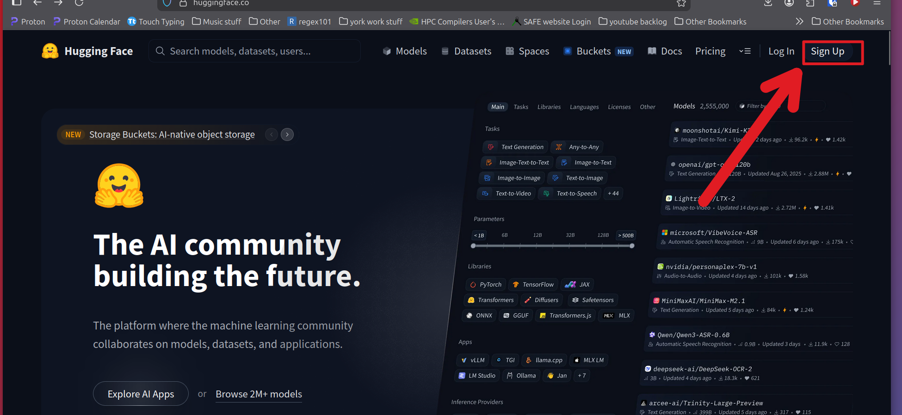

Next click on the image in the top left hand corner and select "access tokens" from the list
that appears.

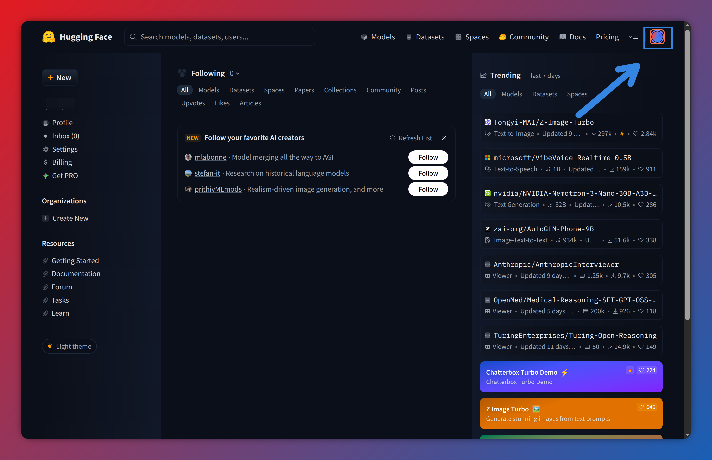

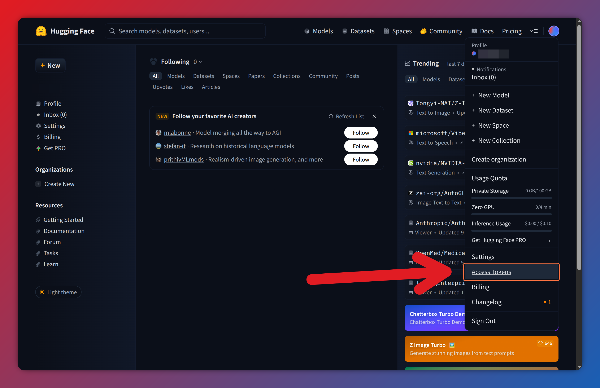

Next click on Click on Create new token. Then give your token a name, this can be anything you like.

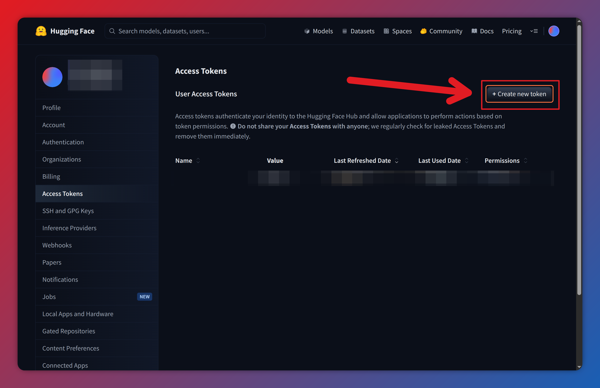

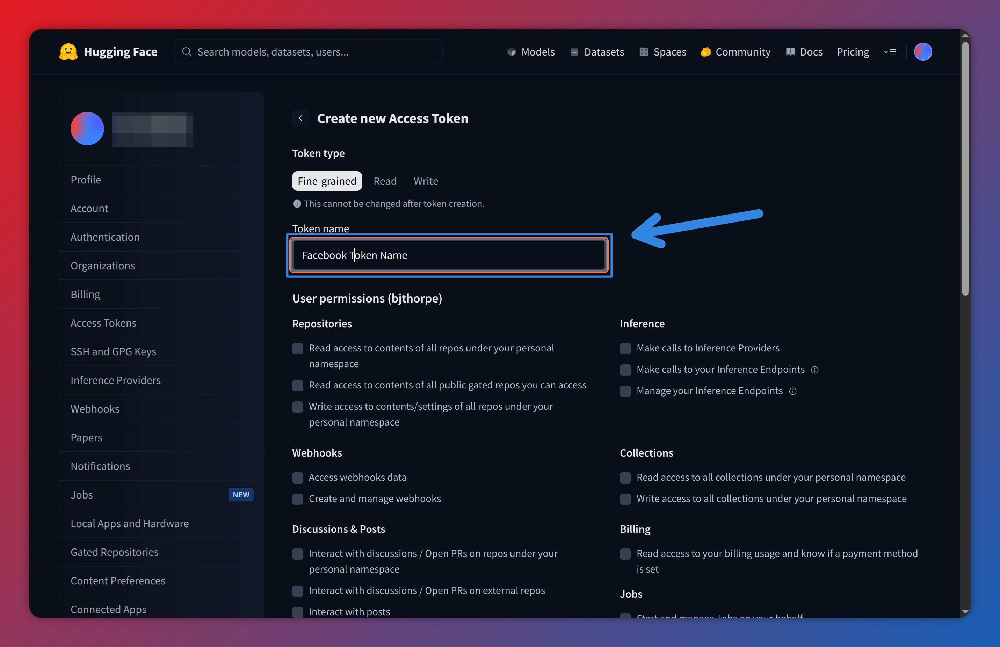
     
Next Check "Read access to contents of all public gated repos you can access" then scroll
to the bottom and click create token.

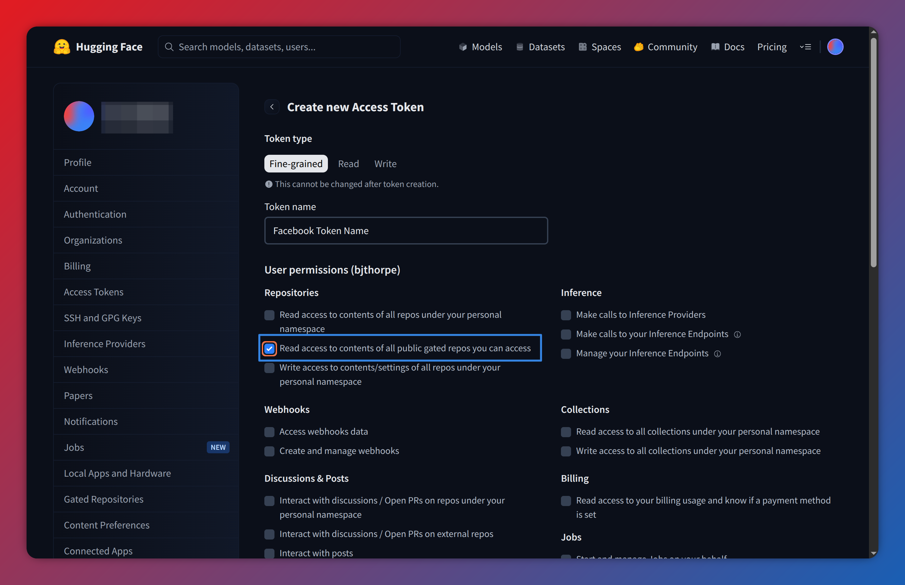

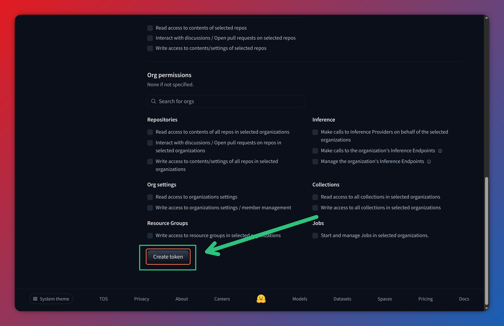

From here you should see a long string of random letters and numbers. This is your API key.

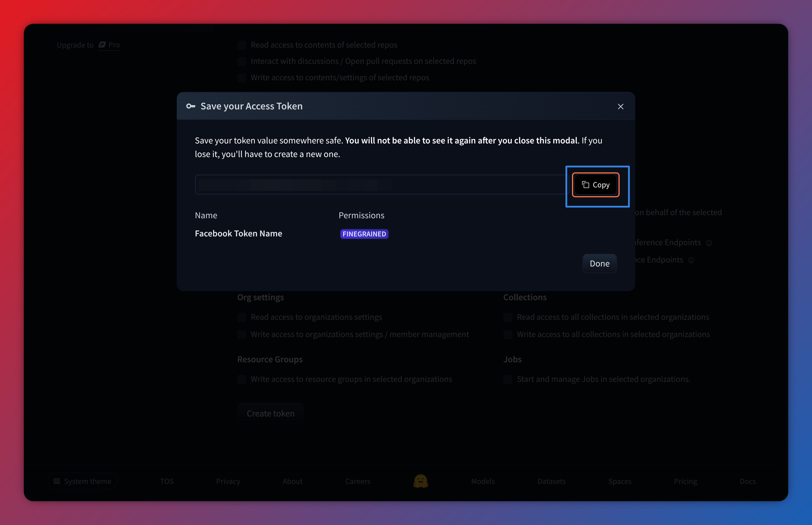
 
Next open the file ``ML_Toolkit/API_Keys/HF_AUTH.key`` in a text editor. Delete the last line 
``1234ABCD`` and paste in your API key. Save this file then click done on the hugging face
window.

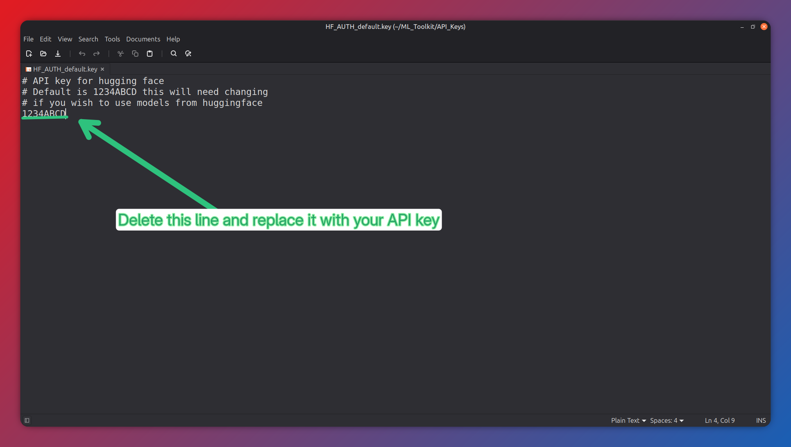

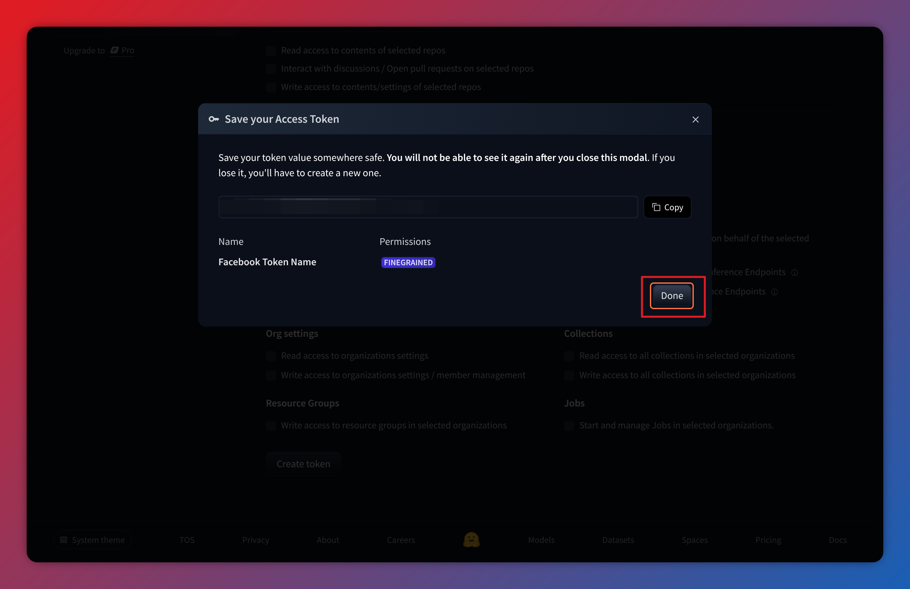

Finally you need to request access to the models themselves. 
There are two model families you need: `OMAT24`_ and the universal model for atoms (`UMA`_)
you need to go to the webpage for each model family then click "Expand to review and access". Then scroll to the bottom, 
fill in the form and click "agree and send request to access repo". You then just need to wait for meta to review this 
and grant you access this is supposed to take up to 48 hours.

Note the screenshots here are for OMAT24 however the procedure for UMA is exactly the same.

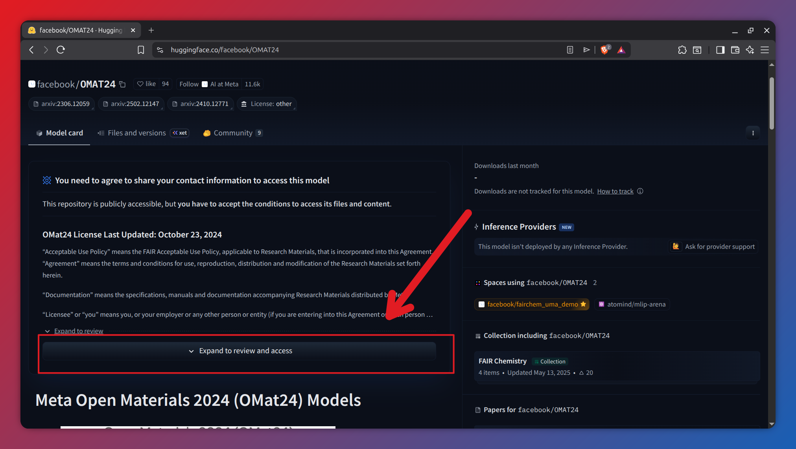

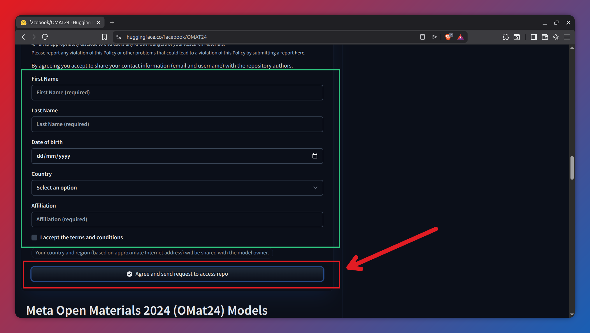

.. _OMAT24: https://huggingface.co/facebook/OMAT24#model-checkpoints
.. _UMA: https://huggingface.co/facebook/UMA
.. _huggingface website: https://huggingface.co/