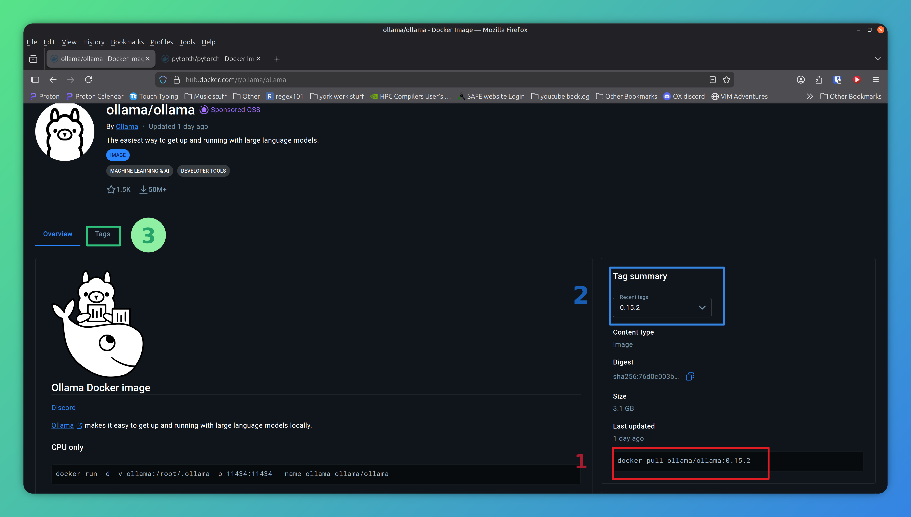
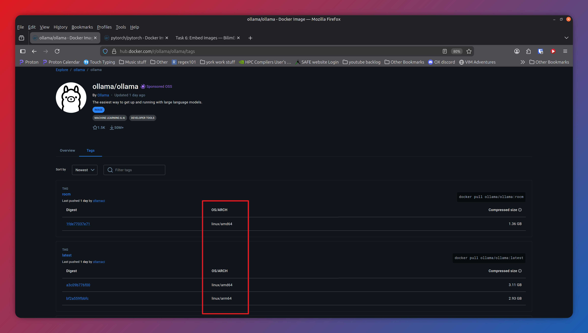

Defining Your Own Containers: DIY Large Language Model (llm)
============================================================

ML_Toolkit is not just limited to the built in AI/ML models for atomic 
potentials. It can in principle be used for any software.
So Lets try something a bit more interesting.
We are going to create our own custom configuration for an llm based 
chatbot using Ollama. At first this may sound intimating, in practice 
however, this is surprisingly straightforward.

To start we need two things:

1. a container config (.yaml) file
2. a container definition

Writing a Container config (.yaml) file
***************************************

We will start with the container config. Create a new file ollama.yaml 
in the Container_Configs directory and add the following text.

Note: the indentation (using 4 spaces at the start of every line after 
"Ollma_Test_container:") is important.

.. code-block:: yaml

    # This is an Ollama Container config to test with
    Ollama_Test_Container:
        description: 'latest version of ollama pulled from dockerhub, for testing'
        group: LLM
        container_definition:

This is all the information we need to define a simple container. There are many 
other options you can use for more advanced cases, which are documented in 
:ref:`Config Options. <Options>` However, these are the only 3 options that are 
strictly required.

If you are familiar with python programming you may have come across the .yaml format 
before. However put simply it's a way of grouping related data together in a human readable 
hierarchy. In our case we are using it to define basic information about our containers
in a way that ML_Toolkit and Apptainer can understand.

Note: lines starting with a # symbol are known as comments. These lines are ignored by 
the computer and are intended as notes to anyone who is reading the file.

A brief aside:
--------------

You can define multiple containers in a single file by simply un-indenting the entry 
for the next container. A good example of this is in Container_configs/Test_containers.yaml
which defines two different containers, used for testing. This can be useful if you have 
multiple related containers you wish to group together.

Returning to the config file, the first actual line "Ollama_Test_Container" is a human 
readable name we will use with the run command. This can be any combination of letters 
and numbers ending with a colon. However, it cannot contain spaces or special characters. 
It should also ideally be short and vaguely descriptive.

As previously mentioned all lines beyond this point need to be indented. This tells
ML_Toolkit that they are information related to "Ollama_Test_Container". They consist 
of a "field name" followed by a colon then the data related to that field. 

Technically you can use be any number of spaces for the indentation (just not tabs) 
as long as you are consistent throughout the file. In this case I have used 4 spaces.

The first indented line is a brief description to tell other people (and sometimes 
yourself in 6 months time) more information about your container. Note: This is the text
that is displayed when using the list command.

The second line defines a group. This is a simple text label to allow you to group similar 
containers together and filter them when using the list command.

The final line is for the container definition. This can either be the path to local 
a definition file (.def) or a link to an external container repository. Which is a special 
type of website that hosts pre-built containers for people to make use of.

For the moment the definition section has been intentionally left blank so lets 
get into what we need for this.

Container Definitions
*********************

Next we need a container definition. This is a blueprint that tells Apptainer how to create 
our container. For this we will create our own .def file that is based on a definition from
an external container repository. 

This is useful when dealing with software as complex as Ollama. As much of the hard work 
has already been done for us we just simply need to tweak it to suit our needs.

Apptainer can access several different container repositories, 
such as Container Library and ORAS.

However, for this we will use `dockerhub`_ which is the public container
repository which is commonly used for a different container software 
called `docker`_. 

This is by far and away the most popular container repository with
official definitions for building containers to work with a huge 
amount of popular software. Including Ollama.

.. _dockerhub: https://hub.docker.com/
.. _docker: https://www.docker.com/
.. _Ollama: https://ollama.com/

To use the definition from dockerhub with our container we will need to
find the apropriate link to dockerhub. 

Links to dockerhub come in two parts a repo name and a version tag 
and have the form:

.. code-block:: bash

    docker pull {REPO_NAME}:{TAG}

In our case we don't need the docker pull section just the repo name and tag.
So to find the software we want we will need to search on `dockerhub`_.
In our case Ollama has an official `image`_.

.. _image: https://hub.docker.com/r/ollama/ollama

To use this we will need to create a container new .def file. In the Definitions
directory, Create a new file. Ollama.def that reads as follows:

.. code-block:: bash

    Bootstrap: docker
    From: ollama/ollama:0.15.2
    # Commands to run when building the container
    %post -c /bin/bash
        apt update && \
        apt -y install python3.12 \
        python3.12-venv python3-pip && \
        python3 -m venv /envs/Ollama_env && \
        source /envs/Ollama_env/bin/activate && \
        pip install ollama

    %startscript
    # Command to run when starting as a background process  
        ollama serve

    %environment
        # CHANGE THE NEXT LINE TO THE DIRECTORY YOU WISH TO STORE MODELS IN
        export OLLAMA_MODELS="/CHANGE/ME"
        export PATH="/envs/Ollama_env/bin:$PATH"

The first two lines of this file tell Apptainer to start with the definition 
from dockerhub for version 0.15.2 of Ollama, the latest version available 
at the time of writing. Note: This string we are using comes from the docker 
pull command. This can generally be found at the bottom right of the docker 
`webpage`_ for the official Ollama image (see the red box on the screenshot, 
you may need to scroll down to find it).

.. _webpage: https://hub.docker.com/r/ollama/ollama

    Screenshot of Ollama page on dockerhub, The corresponding docker pull 
    command is located at the bottom right (shown by the red box with 
    number 1). depending on your device you may need to scroll down to
    find it. The blue box (numbered 2) shows where we have changed the 
    version tag from the default.

Brief aside about tags
----------------------

You may notice we are using a specific version of Ollama. 
By default dockerhub assumes you want the latest available 
version and does not use a tag for this. 

However, it is generally good practice to lock containers on a specific 
version of your software that you know works. This then prevents any 
issues or nasty surprises caused by future updates breaking compatibility.

Omitting the tag also causes issues with Apptainer as if you omit the tag 
Apptainer has no easy way of telling if it's a file or a link to dockerhub.

In our case we selected the exact version we wanted with the dropdown menu
to get the appropriate command (shown by the blue box marked 2 on the screenshot). 
However, if you don't care about the specific version and just want the 
latest one you will need use the tag :latest.

A final note for using dockerhub on Bede
----------------------------------------

There is one final quirk to consider when using containers with dockerhub 
which is specific to Bede. Bede uses the Nvidia GH100 super chips which 
are different to a conventional laptop/desktop PC in that they use 
ARM64 CPUs.

Without going into to much (unnecessary) technical detail they need 
software to be specifically written (built) for them. Dockerhub does 
support builds for ARM64. However, its optional and not all images 
have ARM64 versions.

This is also not helped by the fact it is not obvious at first glance 
which software does/doesn't provide them. The easiest way I've found 
to get this information is look under tags (the green box marked 3). 
On that page there is a column labelled OS/ARCH and you will need 
to check your specific version for **linux/arm64** (not to be 
confused with the similar looking linux/amd64 which are regular 
laptop/desktop cpus).

    Screenshot of tags page for Ollama on dockerhub, The red box
    shows the OS/ARCH column which should have the information 
    you need. This is a good example as the version tagged as "rocm"
    only supports linux/amd64 whereas we need **linux/arm64** which is 
    included in the version tagged as "latest", and indeed version 0.15.2 
    which is off-screen further down the list.

Back to the definition file
***************************

The next section of the .def file, begins at line 4 (the line starting %post).

.. code-block:: bash

    ...

    %post -c /bin/bash
        apt update && \
        apt -y install python3.12 \
        python3.12-venv python3-pip && \
        python3 -m venv /envs/Ollama_env && \
        source /envs/Ollama_env/bin/activate && \
        pip install ollama

    ...

This defines the series of Linux commands that will be run during the build process.
In our case, since we are basing our container of an existing one with Ollama already 
installed. We just need to install python and the ollama pip package to allow us to 
talk to the model via a python script.

The next section begins at line 12 (the line starting %startscript) and defines the 
command that runs when the container is started as a background process. In our 
case this starts the ollama server.

.. code-block:: bash

    ...

    %startscript
    # Command to run when starting as a background process  
        ollama serve

    ...

The final section %environment defines some variables used by ollama. In our case we
need to **change line 17** to the directory you wish to store models in. We recommend
using the Models directory within the ML_Toolkit installation.

.. code-block:: bash

    ...
    %environment
    # CHANGE THE NEXT LINE TO THE DIRECTORY YOU WISH TO STORE MODELS IN
    export OLLAMA_MODELS="/path/to/ML_Toolkit/Models/directory"
    # Leave this line as is
    export PATH="/envs/Ollama_env/bin:$PATH"
    ...

As far as definition files go Apptainer has many more options for more advanced use cases.
You can find out more in the Apptainer `Documentation`_. However, This is all we need for
our purposes.

.. _Documentation: https://apptainer.org/docs/user/main/definition_files.html

With that we have just one final step, adding our new definition to the container config.
Change the container_defintion line in ollama.yaml to the following: 
(remember there should be 4 spaces at the start of the line).

.. code-block:: yaml

        container_definition: Defintions/Ollama.def

Running the LLM
***************

So with the setup out of the way in order to run the llm will essentially need to 
perform 4 steps:

1. use the build command to build the container.
2. use the start command to start the ollama server
3. use the run command to start the model.
4. use the stop command to cleanup and stop the ollama server once we have finished

Frustratingly however, due to how Bede is setup, the exact steps now vary 
depending on if you have installed ML_toolkit locally or are using 
it on Bede.

I'm running locally
-------------------

In this case the build command would be

.. code-block:: bash

    ./ML_Toolkit build Ollama_Test_Container

This will download all the files needed from dockerhub then build the 
container. Once this is complete we can start the Ollama server with:

.. code-block:: bash

    ./ML_Toolkit start Ollama_Test_Container

you can them check everything is up and running by going to http://localhost:11434/
in a web browser and, all being well, you should get a web page with the text 
"Ollama is running".

If this all looks good you can run the following

.. code-block:: bash

    ./ML_Toolkit run Ollama_Test_Container ollama run smollm2:135m

This will download a tiny 135 million parameter model and start an interactive chat 
session. Once you have finished your chat you can exit by typing /bye. From here 
you can explore larger models or other features of Ollama by following the 
official `Ollama documentation`_ . 

.. _Ollama documentation: https://apptainer.org/docs/user/main/definition_files.html

I'm running on Bede
-------------------

As previously mentioned getting things working on the GH100s via Bede requires 
a bit more work.

There are 3 main problems to overcome:

1. We can't (or perhaps shouldn't) run Ollama interactively.
2. We don't have GPU access on the login node.
3. We don't have internet access on the compute nodes.

Point 1 is easy enough to solve as we can inference the model via the python api. 
To do this create a new file called ollama_test_chat.py.

.. code-block:: python

    from ollama import chat
    from ollama import ChatResponse

    #model = 'gemma3:latest'
    model = 'smollm2:135m'
    response: ChatResponse = chat(model=model, messages=[
    {
        'role': 'user',
        'content': 'What is the air-speed velocity of an unladen swallow?',
    },
    ])

    print(response.message.content)

This will interface with Ollama, ask it a very important question, 
then finally print the model's response.

Now to address points two and three. In this case the order of 
operations is important. 

On the login node
-----------------

First we build the container as normal

.. code-block:: bash

    ./ML_Toolkit build Ollama_Test_Container

Next we start the Ollama server

.. code-block:: bash

    ./ML_Toolkit start Ollama_Test_Container

Now we need to run the Ollama pull command to download, but crucially not 
run our model. In this case we'll use smollm2, a tiny model which is 
useful for testing. 

.. code-block:: bash

    ./ML_Toolkit run Ollama_Test_Container ollama pull smollm2:135m

Finally we need to shut the server down

.. code-block:: bash

    ./ML_Toolkit stop Ollama_Test_Container

You will need to do this process for every model you wish to use. 
Thus we recommend automating it with a bash script by copying the 
following into a file called download_models.sh

.. code-block:: bash

    #!/bin/bash
    #  start the Ollama server.
    ./ML_Toolkit start Ollama_Test_Container
    # download the model
    ./ML_Toolkit run Ollama_Test_Container ollama pull $1
    # stop the sever
    ./ML_Toolkit stop Ollama_Test_Container

Then to convert the file into a runnable script run the following command

.. code-block:: bash

    chmod +x download_models.sh

Anytime you want a new model you can then run the script as:

.. code-block:: bash

    ./download_models.sh model_name:tag

Where model_name is the model you want and tag is the specific version. 
For example to download the latest version of gemma3 you would use:

.. code-block:: bash

    ./download_models.sh gemma3:latest

On the compute node
-------------------

With that out of the way we can now finally get to running on the compute nodes.
To do this we will need to create a Slurm script. To do this create the file 
ollama_test.sh and enter the the following text.

.. code-block:: bash

    #!/bin/bash
    # Example SLURM script for testing Ollama on Bede 
    # with the ML_Toolkit
    ##########################################
    #SBATCH --account CHANGE_ME              # charge job to specified account
    #SBATCH --cpus-per-task 1                # number of cpus required per task
    #SBATCH --chdir /path/to/ML_Toolkit      # change working directory
    #SBATCH --job-name ollama_test           # name of job
    #SBATCH --ntasks 1                       # number of processes required
    #SBATCH -o ollama_test.out               # File to redirect program output
    #SBATCH -e ollama_test.err               # File to redirect any errors
    #SBATCH --time 10                        # time limit (in mins)
    #SBATCH --partition ghtest               # Choose either gh or ghtest
    #SBATCH --gres gpu:1                     # Number of GPUs required for the job
    ##########################################
    # source the python virtual environment
    source ML_Toolkit/bin/activate
    #  start the Ollama server.
    ./ML_Toolkit start Ollama_Test_Container
    # inference the model via python script
    ./ML_Toolkit run Ollama_Test_Container python ollama_test_chat.py
    # stop the sever
    ./ML_Toolkit stop Ollama_Test_Container

This is an example script that allocates 1 cpu and 1 gpu for 10 minutes. 
It then starts the Ollama server, runs the python script to inference 
the model then finally, stops the server.

Note: It will need updating with both the location of ML_Toolkit and your 
account name.

Then you can, finally, submit your job to the compute nodes with

.. code-block:: bash

    sbatch ollama_test.sh

Once the has job has made it through the queue and been completed 
by the compute node, all being well, you should see a new file
ollama_test.out. This contains the response to your query from Ollama.